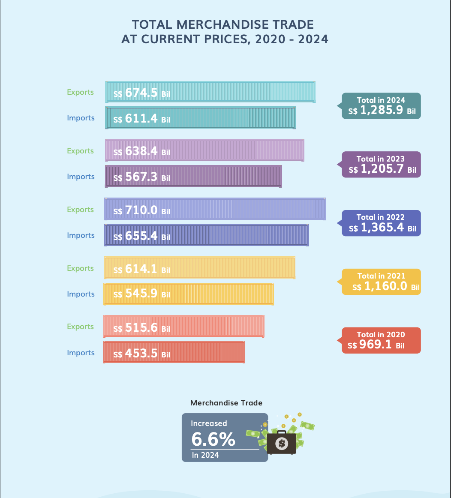
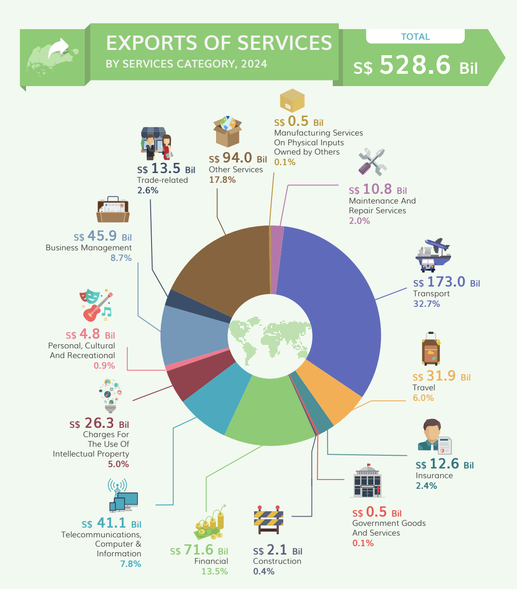
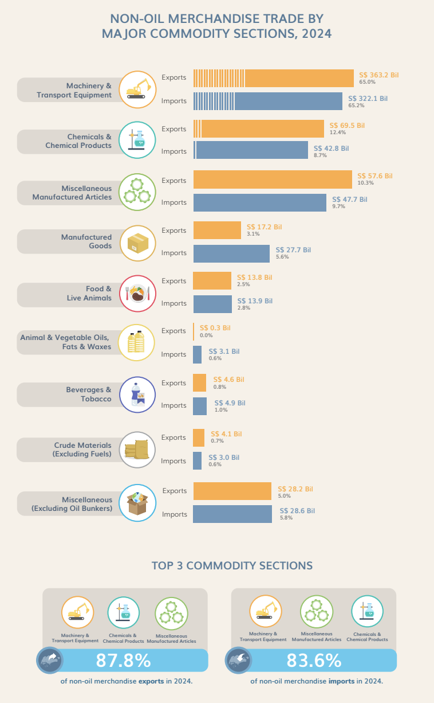

# 1. Overview

Since Mr. Donald Trump took office as the President of the United States on January 20, 2025, one of the most closely watched topics has been global trade.

As a visual analytics novice, I will apply newly acquired techniques to explore and analyze the changing trends and patterns of Singapore’s international trade since 2015.

## **1.2 The Task**

In this exercise, we will use ggplot2 and others packages to do the below tasks:

-   select three data visualisation on [this page](https://www.singstat.gov.sg/modules/infographics/singapore-international-trade), comments on the pros and cons and provide sketches of the make-over

-   create the make-over of the three data visualization critic above

-   analyse the data with time-series analysis by compliment the analysis with appropriate data visualization methods and R packages

# 2. Getting started

We load the following R packages using the `pacman::p_load()` function:

-   [**tidyverse**](https://www.tidyverse.org/): Core collection of R packages designed for data science

-   [**ggthemes**](https://yutannihilation.github.io/allYourFigureAreBelongToUs/ggthemes/): to use additional themes for ggplot2

-   [**patchwork**](https://patchwork.data-imaginist.com/): to prepare composite figure created using ggplot2

-   [**ggridges**](https://cran.r-project.org/web/packages/ggridges/vignettes/introduction.html): to plot ridgeline plots

-   [**ggdist**](https://mjskay.github.io/ggdist/): for visualizations of distributions and uncertainty

-   [**scales**](https://scales.r-lib.org/): provides the internal scaling infrastructure used by ggplot2

-   [**plotly**](https://plotly.com/ggplot2/getting-started/)**:** R library for plotting interactive statistical graphs

-   [**ggstatsplot**](https://indrajeetpatil.github.io/ggstatsplot/): Based Plots with Statistical Details

-   [**ggpubr**](https://github.com/kassambara/ggpubr): For publication-ready plots

```{r}
pacman::p_load(tidyverse,ggthemes,
               ggridges, ggdist,
               patchwork, scales,
               corrplot, ggstatsplot, 
               plotly,ggpubr,
               performance)
```

# 3 Pros and cons on three data visualization and Make-Over

## 3.1 Data visualization 1

### 3.1.1 Pros and cons

{fig-align="center" width="397"}

+--------------------------------------------------------------------------------------------------------------------------------------------------------------------------+-----------------------------------------------------------------------------------------------------------------------------------------------------------------------------------------+
| Pros                                                                                                                                                                     | Cons                                                                                                                                                                                    |
+==========================================================================================================================================================================+=========================================================================================================================================================================================+
| -   **Distinctive Color Coding**                                                                                                                                         | -   **Lack of Trade Surplus or Deficit Information**                                                                                                                                    |
|                                                                                                                                                                          |                                                                                                                                                                                         |
|     Each year is represented in a different color, preventing confusion and helping viewers quickly identify the trade data for different periods.                       |     While the graph shows export and import values, it does not indicate whether a particular year had a **trade surplus (exports \> imports) or trade deficit (exports \< imports)**.\ |
|                                                                                                                                                                          |                                                                                                                                                                                         |
| -   **Highlighted Total Trade Figures**                                                                                                                                  | -   **No Option to Filter Specific Years**                                                                                                                                              |
|                                                                                                                                                                          |                                                                                                                                                                                         |
|     The total trade value for each year is prominently displayed using labels, allowing users to quickly grasp key figures without manually summing exports and imports. |     The graph displays all years at once, which could become visually cluttered when more years are added.\                                                                             |
|                                                                                                                                                                          |                                                                                                                                                                                         |
| -   **Additional Growth Rate Information**                                                                                                                               |                                                                                                                                                                                         |
|                                                                                                                                                                          |                                                                                                                                                                                         |
|     The 6.6% increase in 2024 is highlighted at the bottom, providing a quick snapshot of the trade growth trend.                                                        |                                                                                                                                                                                         |
+--------------------------------------------------------------------------------------------------------------------------------------------------------------------------+-----------------------------------------------------------------------------------------------------------------------------------------------------------------------------------------+

### 3.1.2 Import Data

In this visualization, we will use the data [Merchandise Trade by Region/Market](https://www.singstat.gov.sg/find-data/search-by-theme/trade-and-investment/merchandise-trade/latest-data) from [Department of Statistics Singapore, DOS](https://www.singstat.gov.sg/) website. The below code chunk can help us to import data.

```{r}
library(readxl)
import <- read_excel("data/Trade.xlsx", sheet="T1", skip = 10)
do_export <- read_excel("data/Trade.xlsx", sheet="T2", skip = 10)
re_export <- read_excel("data/Trade.xlsx", sheet="T3", skip = 10)
```

### 3.1.3 Data Preparation

Before we start the makeover, we need to combine the import-total trade data by month into import-total trade data by year. The code chunk below can help us.

Total Imports by year

```{r}
colnames(import)[1] <- "Country/Region"
import_total <- import %>%
  filter(`Country/Region` == "Total All Markets")
import_total <- import_total %>%
  pivot_longer(-`Country/Region`, names_to = "Year", values_to = "Total_Trade_Import")
import_total <- import_total %>%
  mutate(Year = as.numeric(str_extract(Year, "\\d{4}")))
import_total <- import_total %>%
  mutate(Total_Trade_Import = as.numeric(Total_Trade_Import))
import_summary <- import_total %>%
  group_by(Year) %>%
  summarise(Total_Trade_Import = sum(Total_Trade_Import, na.rm = TRUE)) %>%
  arrange(desc(Year))  

print(import_summary)
```

Total Domestic Exports by year

```{r}
colnames(do_export)[1] <- "Country/Region"
do_export_total <- do_export %>%
  filter(`Country/Region` == "Total All Markets")
do_export_total <- do_export_total %>%
  pivot_longer(-`Country/Region`, names_to = "Year", values_to = "Total_Trade_do_Export")
do_export_total <- do_export_total %>%
  mutate(Year = as.numeric(str_extract(Year, "\\d{4}")))
do_export_total <- do_export_total %>%
  mutate(Total_Trade_do_Export = as.numeric(Total_Trade_do_Export))
do_export_summary <- do_export_total %>%
  group_by(Year) %>%
  summarise(Total_Trade_do_Export = sum(Total_Trade_do_Export, na.rm = TRUE)) %>%
  arrange(desc(Year)) 

print(do_export_summary)
```

Total Re-Exports by year

```{r}
colnames(re_export)[1] <- "Country/Region"
re_export_total <- re_export %>%
  filter(`Country/Region` == "Total All Markets")
re_export_total <- re_export_total %>%
  pivot_longer(-`Country/Region`, names_to = "Year", values_to = "Total_Trade_re_Export")
re_export_total <- re_export_total %>%
  mutate(Year = as.numeric(str_extract(Year, "\\d{4}")))
re_export_total <- re_export_total %>%
  mutate(Total_Trade_re_Export = as.numeric(Total_Trade_re_Export))
re_export_summary <- re_export_total %>%
  group_by(Year) %>%
  summarise(Total_Trade_re_Export = sum(Total_Trade_re_Export, na.rm = TRUE)) %>%
  arrange(desc(Year)) 

print(re_export_summary)
```

Total Exports by year

```{r}
total_export_summary <- re_export_summary %>%
  left_join(do_export_summary, by = "Year") %>%
  mutate(Total_Trade_Export = Total_Trade_do_Export + Total_Trade_re_Export) %>%
  select(Year, Total_Trade_Export)

print(total_export_summary)
```

At the end, we will combine the total import and total export into one dataset called `trade_balance`, and also calculate the trade balance and trade status.

```{r}
trade_balance <- import_summary %>%
  left_join(total_export_summary, by = "Year") %>%
  mutate(
    Trade_Balance = Total_Trade_Export - Total_Trade_Import,  
    Trade_Status = ifelse(Trade_Balance > 0, "Surplus", "Deficit")  
  ) %>%
  arrange(desc(Year)) 


print(trade_balance)
```

### 3.1.4 Make-Over of Data visualization 1

First, calculate the total trade, trade balance, and trade status. The code below will help us.

```{r}
trade_balance <- import_summary %>%
  left_join(total_export_summary, by = "Year") %>%
  mutate(
    Total_Trade = Total_Trade_Import + Total_Trade_Export,  
    Trade_Balance = Total_Trade_Export - Total_Trade_Import, 
    Trade_Status = ifelse(Trade_Balance > 0, "Surplus", "Deficit") 
  ) %>%
  arrange(desc(Year)) 


print(trade_balance)
```

Second, use ggplot2 and other packages to create the graph.

```{r}
trade_data <- trade_balance %>%
  filter(Year >= 2020 & Year <= 2024) %>% 
  pivot_longer(cols = c(Total_Trade_Import, Total_Trade_Export),
               names_to = "Trade_Type", values_to = "Trade_Value")

p <- ggplot(trade_data, aes(x = Trade_Value, y = factor(Year), fill = Trade_Type,
                            text = paste("Year:", Year,
                                         "<br>Trade Type:", Trade_Type,
                                         "<br>Trade Value: S$", round(Trade_Value / 1e3, 1), "B",
                                         "<br>Trade Balance: S$", round(Trade_Balance / 1e3, 1), "B",
                                         "<br>Trade Status:", Trade_Status))) +
  geom_col(position = "dodge", width = 0.6) +
  
 
  geom_text(data = trade_data %>% filter(Trade_Type == "Total_Trade_Export"),
            aes(x = max(Trade_Value) * 1.15, y = factor(Year),
                label = paste0("Total: S$", round(Total_Trade / 1e3, 1), "B")),
            hjust = -0.3, size = 3, color = "purple") + 
  
  scale_fill_manual(values = c("Total_Trade_Import" = "#E69F00", "Total_Trade_Export" = "#56B4E9")) +
  labs(title = "Total Merchandise Trade (2020-2024) with Trade Balance",
       x = "Trade Value (Billion S$)", y = "", fill = "Trade Type") +
  theme_minimal() +
  theme(legend.position = "top",
        plot.margin = margin(10, 250, 10, 10))  


p_interactive <- ggplotly(p, tooltip = "text") %>%
  layout(margin = list(r = 250)) 


p_interactive
```

::: callout-note
## Improvement

**1. Addition of Trade Surplus and Deficit Information**

-   The new chart explicitly shows the **trade status** and **balance** for each year in purple text, allowing users to quickly determine whether a year had a surplus or deficit. This makes it much easier to assess the overall trade performance.

**2. Enhanced Interactivity for Better Data Understanding**

-   The updated version incorporates **interactive elements**, enabling users to explore trade data more effectively. This helps in identifying patterns, trends, and year-on-year changes in a more intuitive way.
:::

### 3.1.5 Findings

**1. Trade Trend Analysis**

-   Observing trade changes from 2020 to 2024, both imports (Total_Trade_Import) and exports (Total_Trade_Export) show a steady growth trend.

-   The total trade value in 2020 is significantly lower than in the following years, likely due to the impact of the pandemic, causing trade to shrink before gradually recovering.

2\. **Import-Export Differences (Trade Balance)**

-   The chart indicates that exports (blue bars) exceed imports (orange bars) in all years, meaning the country consistently maintains a trade surplus.

## 3.2 Data Visualization 2

### 3.2.1 Pros and cons

{fig-align="center" width="442"}

+----------------------------------------------------------------------------------------------------------------------------------------------------------------------------+---------------------------------------------------------------------------------------------------------------+
| Pros                                                                                                                                                                       | Cons                                                                                                          |
+============================================================================================================================================================================+===============================================================================================================+
| -   **Clear Information and Categorization**                                                                                                                               | -   **Pie Chart May Not Be the Best Choice**                                                                  |
|                                                                                                                                                                            |                                                                                                               |
|     The service export data is categorized by different sectors, with values and percentages labeled, allowing readers to quickly grasp the contribution of each category. |     Pie charts make it difficult to compare different categories, especially when values are similar.         |
|                                                                                                                                                                            |                                                                                                               |
| -   **Highlighting Total Export Value**                                                                                                                                    | -   **Numerical Labels Could Be Optimized**                                                                   |
|                                                                                                                                                                            |                                                                                                               |
|     The total export value **S\$ 528.6 Billion** is prominently displayed in green, ensuring that readers can quickly recognize the overall scale.                         |     Some numerical labels (e.g: 0.1%) take up visual space despite having minimal impact on the overall data. |
|                                                                                                                                                                            |                                                                                                               |
| -   **Well-structured Labels and Connections**                                                                                                                             |                                                                                                               |
|                                                                                                                                                                            |                                                                                                               |
|     Each category’s data point is linked to its corresponding segment in the pie chart with guiding lines, making it easier to follow the data.                            |                                                                                                               |
+----------------------------------------------------------------------------------------------------------------------------------------------------------------------------+---------------------------------------------------------------------------------------------------------------+

### 3.2.2 Import Data

In this visualization, we will use the data [Trade In Services By Services Category, Annual](https://tablebuilder.singstat.gov.sg/table/TS/M060251) from [Department of Statistics Singapore, DOS](https://www.singstat.gov.sg/) website. The below code chunk can help us to import data.

```{r}
library(readxl)
exports_by_services <- read_excel("data/Exports_by_services.xlsx",skip = 10)
```

### 3.2.3 Data Preparation

Before we start the data visualization, we need to aggregate the exports of services-total trade data from a monthly level to a yearly level. The code chunk below facilitates this process by summing the trade values for 2024.

```{r}
#| message: false
#| warning: false
export_start <- which(exports_by_services$`Data Series` == "Exports Of Services")


export_end <- which(exports_by_services$`Data Series` == "Other Business Services")


exports_filtered <- exports_by_services %>%
  slice((export_start):(export_end)) %>%  
  select(`Data Series`, `2024`)  

colnames(exports_filtered) <- c("Category", "Value_2024")


exports_filtered <- exports_filtered %>%
  mutate(Value_2024 = as.numeric(Value_2024),
         Value_2024_Billion = round(Value_2024 / 1e3, 1))


print(exports_filtered)
```

### 3.2.4 Make-over of Data Visualization 2

Use ggplot2 and other packages to create the graph.

```{r}
#| fig-width: 10
#| fig-height: 7
exports_filtered_plot <- exports_filtered %>%
  filter(Category != "Exports Of Services")

exports_total <- exports_filtered %>%
    filter(Category == "Exports Of Services") %>%
    pull(Value_2024_Billion)


exports_filtered_plot <- exports_filtered_plot %>%
  mutate(Percentage = round((Value_2024_Billion / exports_total) * 100, 1))


p2 <- ggplot(exports_filtered_plot, aes(x = Value_2024_Billion, y = reorder(Category, Value_2024_Billion))) +
  geom_col(fill = "steelblue") + 
  labs(
    title = "Exports of Services by Category (2024)", 
    x = "Value (Billion S$)",  
    y = "" 
  ) +
  theme_minimal() +  
  theme(
    text = element_text(size = 14), 
    axis.text.x = element_text(size = 12),
    axis.text.y = element_text(angle = 30, hjust = 1, size= 8) 
  )


p2_interactive <- ggplotly(p2, tooltip = c("x", "y")) %>%
  layout(
    hoverlabel = list(bgcolor = "black", font = list(color = "white"))  
  ) %>%
  style(
    text = paste(
      "Type:", exports_filtered_plot$Category,
      "<br>Value:", exports_filtered_plot$Value_2024_Billion, "Billion",
      "<br>Percentage:", exports_filtered_plot$Percentage, "%"
    ),
    hoverinfo = "text"  
  )  

p2_interactive
```

::: callout-note
## Improvement

**1. Switched from a Pie Chart to a Bar Chart**

-   The previous pie chart made it difficult to compare categories, especially when values were similar. The new bar chart improves readability by presenting the data in a clear, ranked format, making it easier to identify the top and bottom categories at a glance.

**2. Enhanced Interactivity for Better Data Understanding**

-   The updated version incorporates interactive elements such as tooltips, hover effects. These enhancements allow users to explore trade data more effectively, making it easier to compare categories.
:::

### 3.2.5 Findings

**1. Dominance of Transport and Business Services**

-   The chart indicates that "Transport" and "Other Business Services" are the two largest contributors to service exports in 2024, each exceeding 100 billion S\$. This suggests that these sectors play a crucial role in the country's service economy.

**2. Large Disparity Between Categories**

-   The top three categories contribute significantly more than others, with lower-ranked services like "Government Goods and Services" adding minimal value.

**3. Potential for Smaller Sectors**

-   Categories like "Personal, Cultural, and Recreational Services" and "Maintenance and Repair Services" have low exports but may present growth opportunities.

## 3.3 Data Visualization 3

### 3.3.1 Pros and cons

{fig-align="center" width="367"}

+------------------------------------------------------------------------------------------------------------------------------------------------------------------+-----------------------------------------------------------------------------------------------------------------------------------------------------------------------------------------------------------------------------------------------------+
| Pros                                                                                                                                                             | Cons                                                                                                                                                                                                                                                |
+==================================================================================================================================================================+=====================================================================================================================================================================================================================================================+
| -   **Clearly Labeled Data**                                                                                                                                     | -   **Distorted Bar Chart Proportions**                                                                                                                                                                                                             |
|                                                                                                                                                                  |                                                                                                                                                                                                                                                     |
|     Each category's export and import values are clearly marked, along with percentages, helping readers quickly understand the proportion of each category.     |     The "Machinery & Transport Equipment" category (**S\$ 363.2B and S\$ 322.1B**) appears similar in length to "Food & Live Animals" (**S\$ 13.8B and S\$ 13.9B**), making it difficult for readers to perceive the actual proportion differences. |
|                                                                                                                                                                  |                                                                                                                                                                                                                                                     |
| -   **Icons for Better Comprehension**                                                                                                                           | -   **No Indication of Trade Surplus and Deficit**                                                                                                                                                                                                  |
|                                                                                                                                                                  |                                                                                                                                                                                                                                                     |
|     Each commodity category is accompanied by corresponding small icons (e.g., machinery, food, chemicals), allowing readers to quickly identify the categories. |     The chart shows export and import figures but does not clearly indicate which categories have a **trade surplus** or **trade deficit.**                                                                                                         |
|                                                                                                                                                                  |                                                                                                                                                                                                                                                     |
|                                                                                                                                                                  | -   **"TOP 3 COMMODITY SECTIONS"** labeling for imports and exports is not very clear                                                                                                                                                               |
|                                                                                                                                                                  |                                                                                                                                                                                                                                                     |
|                                                                                                                                                                  |     Using the same colors makes it difficult for viewers to immediately distinguish between **imports** and **exports** at a glance.                                                                                                                |
+------------------------------------------------------------------------------------------------------------------------------------------------------------------+-----------------------------------------------------------------------------------------------------------------------------------------------------------------------------------------------------------------------------------------------------+

### 3.3.2 Import Data

In this visualization, we will use the data [Merchandise Trade By Commodity Section, (At Current Prices)](https://tablebuilder.singstat.gov.sg/table/TS/M451001) from [Department of Statistics Singapore, DOS](https://www.singstat.gov.sg/) website. The below code chunk can help us to import data.

```{r}
library(readxl)
non_oil <- read_excel("data/Non-oil.xlsx",skip = 10)
```

### 3.3.3 Data Preparation

First, we will select the import data for the category of non-oil merchandise trade by major commodity sections in 2024 on a monthly basis, and then sum them yearly.

```{r}
non_import_start <- which(non_oil$`Data Series` == "Total Merchandise Imports, (At Current Prices)")


non_import_end <- which(non_oil$`Data Series` == "Total Merchandise Exports, (At Current Prices)")


non_import_filtered <- non_oil %>%
  slice((non_import_start+4):(non_import_end-1)) %>%  
  select(`Data Series`, contains("2024")) %>%  
  mutate(Value_2024 = rowSums(across(-`Data Series`), na.rm = TRUE)) %>%  
  select(`Data Series`, Value_2024)  


colnames(non_import_filtered) <- c("Category", "Value_2024_Import")


non_import_filtered <- non_import_filtered %>%
  mutate(Value_2024_Import = as.numeric(Value_2024_Import),
         Value_2024_Billion_Import = round(Value_2024_Import / 1e6, 1))


print(non_import_filtered)
```

Next, we will select the export data for the category of non-oil merchandise trade by major commodity sections in 2024 on a monthly basis, and then sum them yearly.

```{r}
non_export_start <- which(non_oil$`Data Series` == "Total Merchandise Exports, (At Current Prices)")


non_export_end <- which(non_oil$`Data Series` == "Total Domestic Exports, (At Current Prices)")


non_export_filtered <- non_oil %>%
  slice((non_export_start+5):(non_export_end-1)) %>%  
  select(`Data Series`, contains("2024")) %>%  
  mutate(Value_2024 = rowSums(across(-`Data Series`), na.rm = TRUE)) %>%  
  select(`Data Series`, Value_2024)  


colnames(non_export_filtered) <- c("Category", "Value_2024_Export")


non_export_filtered <- non_export_filtered %>%
  mutate(Value_2024_Export = as.numeric(Value_2024_Export),
         Value_2024_Billion_Export = round(Value_2024_Export / 1e6, 1))


print(non_export_filtered)
```

At the end, we will combine the import and export data into one dataset called `non_oil_trade`, and also calculate the trade balance and trade status.

```{r}
non_oil_trade <- full_join(non_import_filtered, non_export_filtered, by = "Category") %>%
  mutate(
    Trade_Balance = Value_2024_Export - Value_2024_Import,  
    Trade_Balance_Billion = round(Trade_Balance / 1e6, 1), 
    Trade_Status = case_when(
      Trade_Balance > 0 ~ "Trade Surplus",  
      Trade_Balance < 0 ~ "Trade Deficit",  
      TRUE ~ "Balanced Trade"               
    )
  )


print(non_oil_trade)

```

### 3.3.4 Make-Over of Data visualization 3

```{r}
p <- ggplot(non_oil_trade, aes(y = reorder(Category, Value_2024_Billion_Export), text = paste(
  "Category: ", Category, "<br>",
  "Export: S$", Value_2024_Billion_Export, "B<br>",
  "Import: S$", Value_2024_Billion_Import, "B<br>",
  "Trade Balance: S$", Trade_Balance_Billion, "B<br>",
  "Status: ", Trade_Status
))) +
  geom_bar(aes(x = Value_2024_Billion_Export, fill = "Export"), stat = "identity", position = "dodge", width = 0.6) +
  geom_bar(aes(x = -Value_2024_Billion_Import, fill = "Import"), stat = "identity", position = "dodge", width = 0.6) +
  
  scale_fill_manual(values = c("Export" = "#F4A261", "Import" = "#2A9D8F"),
                    labels = c("Export", "Import")) +
  
  geom_point(aes(x = Trade_Balance_Billion, color = Trade_Status), size = 4) +
  
  scale_color_manual(values = c("Trade Surplus" = "blue", "Trade Deficit" = "red"),
                     labels = c("Trade Surplus", "Trade Deficit")) +
  
  labs(title = "Non-Oil Merchandise Trade by Major Commodity Sections, 2024",
       x = "Trade Value (Billion S$)",
       y = "",
       fill = "Trade Type",
       color = "Trade Status") +
  
  theme_minimal() +
  theme(
        legend.position = "bottom",  
        legend.title = element_text(size = 12), 
        legend.text = element_text(size = 10),  
        axis.text.y = element_text(size = 8, angle = 30),  
        axis.text.x = element_text(size = 12),
        plot.title = element_text(size = 14, face = "bold", hjust = 0.5))


p_interactive <- ggplotly(p, tooltip = "text")


p_interactive
```

::: callout-note
## Improvement

**1. Clear Representation of Trade Surplus and Deficit**

-   The new chart includes visual markers (red for trade deficit and blue for trade surplus), making it easier to **identify** which categories contribute positively or negatively to the trade balance.

**2. Better Proportional Representation**

-   The updated version **properly scales the bars**, ensuring a more **accurate comparison** of trade values across different categories.

**3. Enhanced Interactivity for Better Data Exploration**

-   The new version incorporates **interactive elements** (e.g., hover effects, tooltips, and filtering options), allowing users to explore specific trade categories **more easily**.
:::

### 3.3.5 Findings

**1. Trade Surplus vs. Trade Deficit Analysis**

-   Categories like **Machinery & Transport Equipment** and **Chemicals & Chemical Products** show a **trade surplus**, indicating that exports exceed imports in these sectors.

-   On the other hand, categories such as **Food & Live Animals** and **Crude Materials (Excl. Fuels)** experience a **trade deficit**, where imports are higher than exports.

**2. Disproportionate Trade Volume Across Categories**

-   The **Machinery & Transport Equipment** sector has the highest trade volume, both in imports and exports, making it a key contributor to overall trade.

-   Sectors like **Animal & Vegetable Oils, Fats & Waxes** have minimal trade activity, reflecting either lower demand or lower production in these areas.

# 4. Time-series analysis

## 4.1 **Getting Started**

For the purpose of this analysis, the following R packages will be used.

```{r}
pacman::p_load(tidyverse, tsibble, feasts, fable, seasonal)
```

### **4.1.2 Importing the data**

First, `read_excel` of **readxl** package is used to import *Trade.xlsx* file into R environment. The imported file is saved an tibble object called *ts_data*.

```{r}
library(readxl)
ts_data <- read_excel(
  "data/Trade.xlsx", sheet="T4")
```

In the code chunk below, `parse_date_time` is used to convert data type of Month-Year field from Character to Date.

```{r}
ts_data$`Data Series` <- parse_date_time(ts_data$`Data Series`, orders = "Y b")

head(ts_data)
```

### **4.1.3 Conventional base `ts` object versus `tibble` object**

tibble object

```{r}
ts_data
```

### **4.1.4 Conventional base `ts` object versus `tibble` object**

ts object

```{r}
ts_data_ts <- ts(ts_data)       
head(ts_data_ts)
```

### **4.1.5 Converting `tibble` object to `tsibble` object**

The code chunk below converting ts_data from tibble object into tsibble object by using [`as_tsibble()`](https://tsibble.tidyverts.org/reference/as-tsibble.html) of **tsibble** R package.

```{r}
ts_tsibble <- ts_data %>%
  mutate(Month = yearmonth(`Data Series`)) %>%
  as_tsibble(index = `Month`)
```

### **4.1.6 tsibble object**

```{r}
ts_tsibble
```

## **4.2 Visualising Time-series Data**

In order to visualise the time-series data effectively, we need to organise the data frame from wide to long format by using [`pivot_longer()`](https://tidyr.tidyverse.org/reference/pivot_longer.html) of **tidyr** package as shown below.

```{r}
ts_longer <- ts_data %>%
  pivot_longer(cols = c(2:34),
               names_to = "Country",
               values_to = "Trade")
```

### **4.2.1 Visualising single time-series: ggplot2 methods**

```{r}
#| message: false
#| warning: false
ts_longer %>%
  filter(Country == "America") %>%
  ggplot(aes(x = `Data Series`, 
             y = Trade))+
  geom_line(size = 0.5)
```

The time series plot illustrates the trend of trade from America over the years. The data reveals a general upward trajectory, with trade volumes increasing steadily from the early 2000s to 2025. However, there are noticeable fluctuations throughout the period, indicating potential economic cycles, trade policy changes, or global market conditions affecting the trade flow.

A significant surge in trade is observed after 2020, suggesting a strong post-pandemic economic recovery or an increase in trade agreements and exports. This rapid growth may be driven by factors such as supply chain normalization, increased global demand, or government stimulus measures. Towards the end of the timeline, there is a slight decline, which may indicate market corrections, trade restrictions, or economic slowdowns in key industries.

### **4.2.2 Plotting multiple time-series data with ggplot2 methods**

```{r}
ggplot(data = ts_longer, 
       aes(x = `Data Series`, 
           y = Trade,
           color = Country))+
  geom_line(size = 0.5) +
  theme(legend.position = "bottom", 
        legend.box.spacing = unit(0.5, "cm"))
```

In order to provide effective comparison, [`facet_wrap()`](https://ggplot2.tidyverse.org/reference/facet_wrap.html) of **ggplot2** package is used to create small multiple line graph also known as trellis plot.

```{r}
#| fig-width: 12
#| fig-height: 10
ggplot(data = ts_longer, 
       aes(x = `Data Series`, 
           y = Trade))+
  geom_line(size = 0.5) +
  facet_wrap(~ Country,
             ncol = 3,
             scales = "free_y") +
  theme_bw()
```

This visualization presents a comparative analysis of trade arrivals across multiple countries over time. Each panel represents a different country, showing how trade activity has evolved in distinct regions. Countries like America and Asia exhibit a steady upward trend, suggesting consistent growth in trade, while others, such as Antigua and Barbuda or Bermuda, show sporadic fluctuations with sharp peaks and troughs.

The use of individual scales for each country ensures better visibility of trade patterns, especially for countries with smaller trade volumes. Additionally, noticeable spikes in countries like Argentina, Mexico, and Ecuador may indicate periods of heightened trade activity, possibly influenced by economic factors or policy changes. This visualization helps in understanding regional trade dynamics and long-term economic trends.

## **4.3 Visual Analysis of Time-series Data**

In order to visualise the time-series data effectively, we need to organise the data frame from wide to long format by using [`pivot_longer()`](https://tidyr.tidyverse.org/reference/pivot_longer.html) of **tidyr** package as shown below.

```{r}
tsibble_longer <- ts_tsibble %>%
  pivot_longer(cols = c(2:34),
               names_to = "Country",
               values_to = "Trade")
```

### **4.3.1 Visual Analysis of Seasonality with Cycle Plot**

A **cycle plot** shows how a trend or cycle changes over time. We can use them to see seasonal patterns. Typically, a cycle plot shows a measure on the Y-axis and then shows a time period (such as months or seasons) along the X-axis. For each time period, there is a trend line across a number of years.

Figure below shows two time-series lines of visitor arrivals from America and Canada. Both lines reveal clear sign of seasonal patterns but not the trend.

```{r}
tsibble_longer %>%
  filter(Country == "America" |
         Country == "Canada") %>% 
  autoplot(Trade) + 
  facet_grid(Country ~ ., scales = "free_y")
```

In the code chunk below, cycle plots using [`gg_subseries()`](https://feasts.tidyverts.org/reference/gg_subseries.html) of feasts package are created. Notice that the cycle plots show not only seasonal patterns but also trend.

```{r}
#| fig-width: 12
#| fig-height: 10
tsibble_longer %>%
  filter(Country == "America" |
         Country == "Canada") %>% 
  gg_subseries(Trade)
```

This visualization displays trade trends over time for two countries, America and Canada, segmented by month. The black lines represent monthly trade values, while the blue trend lines provide an indication of the overall trade trajectory.

For America, trade values are significantly higher, exhibiting strong fluctuations throughout the year with frequent spikes, suggesting periods of increased trade activity. In contrast, Canada’s trade values are much lower, but the pattern also shows gradual growth with occasional sharp peaks.

The month-wise facetting helps in identifying seasonal trends or periodic trade surges, allowing for a better understanding of how trade varies throughout the year in these two regions.

## **4.4 Time series decomposition**

### **Multiple time-series decomposition**

Code chunk below is used to prepare a trellis plot of ACFs for visitor arrivals from America, Canada, Brazil and Colombia.

```{r}
tsibble_longer %>%
  filter(`Country` == "America" |
         `Country` == "Canada" |
         `Country` == "Brazil" |
         `Country` == "Colombia") %>%
  ACF(Trade) %>%
  autoplot()
```

The autocorrelation function (ACF) plots for America, Brazil, Canada, and Colombia illustrate the correlation between current and past trade values over different time lags.

**1. Strong Persistence in Trade Trends:**

-   The ACF values remain high over multiple lags, particularly in America and Brazil, indicating that trade values exhibit strong temporal dependence. This suggests that past trade performance has a significant influence on future trade patterns, likely due to long-term contracts, stable market demands, or macroeconomic factors.

-   The gradual decline in autocorrelation over time suggests that while trade values remain correlated, the impact of past values weakens as the time lag increases.

**2. Seasonal and Cyclical Patterns:**

-   The recurring peaks in the ACF plots suggest a periodic pattern in trade activities, likely driven by seasonal fluctuations or economic cycles.

-   The presence of noticeable drops and rises in autocorrelation at regular intervals may indicate that certain trade sectors experience predictable demand and supply shifts throughout the year, such as increased exports during peak production seasons or import surges tied to market demands.

-   In contrast, Canada and Colombia show weaker autocorrelations beyond the first few lags, which may suggest more volatile or less structured trade patterns compared to America and Brazil.

Overall, these ACF plots highlight that trade dynamics are not random but instead follow structured trends influenced by past trade values, seasonality, and possibly external economic factors.

## **4.5 Visual STL Diagnostics**

STL is a robust method of time series decomposition often used in economic and environmental analyses. The STL method uses locally fitted regression models to decompose a time series into trend, seasonal, and remainder components.

### **4.5.1 Visual STL diagnostics with feasts**

In the code chunk below, `STL()` of **feasts** package is used to decomposite the trend of trade from America data.

```{r}
tsibble_longer %>%
  filter(`Country` == "America") %>%
  model(stl = STL(Trade)) %>%
  components() %>%
  autoplot()
```

This STL decomposition plot breaks down trade data into three key components: trend, seasonality, and remainder.

**1. Long-Term Trend:**

-   The trend component shows a general upward trajectory in trade over time, indicating steady growth. There are noticeable fluctuations, particularly around 2015 and 2020, where trade appears to experience temporary declines before resuming an upward movement. The recent trend suggests an acceleration in trade activity post-2020.

**2. Seasonal Patterns:**

-   The seasonal component exhibits a recurring pattern with periodic peaks and troughs, suggesting that trade follows a predictable annual cycle. These fluctuations could be attributed to market demands, seasonal exports and imports, or economic cycles. The seasonality appears relatively stable, indicating that external shocks have not significantly disrupted these patterns.

**3. Residual Variability:**

-   The remainder component captures short-term variations that cannot be explained by trend or seasonality. There are noticeable spikes, particularly around financial crises or external shocks. Increased volatility in recent years suggests that trade has become more unpredictable, possibly due to global economic uncertainties, policy changes, or market disruptions.

Overall, the decomposition highlights a strong upward trend in trade, stable seasonal effects, and increasing short-term fluctuations in recent years. This suggests that while trade is growing, it is also subject to periodic and external influences that cause temporary disruptions.

### **4.5.2 Classical Decomposition with feasts**

In the code chunk below, `classical_decomposition()` of **feasts** package is used to decompose a time series into seasonal, trend and irregular components using moving averages. THe function is able to deal with both additive or multiplicative seasonal component.

```{r}
#| message: false
#| warning: false
tsibble_longer %>%
  filter(`Country` == "America") %>%
  model(
    classical_decomposition(
      Trade, type = "additive")) %>%
  components() %>%
  autoplot()
```

This classical decomposition plot dissects the trade data into three key components: trend, seasonality, and random fluctuations, offering a clearer view of underlying patterns.

**1. Long-Term Trend:**

-   The trend component reveals a steady upward trajectory in trade over time, with noticeable periods of growth and decline. A slowdown is evident around 2015, followed by a strong recovery after 2020. This suggests that trade has been resilient despite economic fluctuations, rebounding after downturns.

**2. Seasonal Variations:**

-   The seasonal component exhibits a consistent cyclical pattern, indicating that trade activity follows a regular, predictable annual rhythm. These recurring peaks and troughs suggest the presence of systematic seasonal effects, likely influenced by economic cycles, industry demands, or policy changes.

**3. Unexplained Variability:**

-   The random component captures short-term variations that cannot be explained by trend or seasonality. Periods of high volatility are observed, particularly around financial crises and external shocks. Recent years show an increase in fluctuations, implying that trade has become more unpredictable, potentially due to economic uncertainty or external disruptions.

Overall, the decomposition highlights a strong long-term upward trend, stable seasonal effects, and periods of increased short-term volatility. This analysis helps distinguish systematic trade patterns from irregular shocks, providing valuable insights for economic forecasting and policy planning.

# 5. Conclusion

Through a detailed visual and statistical analysis of Singapore’s trade data, several key insights emerge. First, trade has exhibited a strong long-term growth trend, with significant fluctuations influenced by economic events such as financial crises and the COVID-19 pandemic. The introduction of trade surplus and deficit indicators in visualizations has improved clarity, making it easier to assess trade performance across different sectors.

The use of time-series analysis reveals distinct seasonal patterns, suggesting that trade volumes follow a predictable annual cycle, likely driven by global demand shifts and policy changes. Additionally, decomposition techniques highlight both the resilience of trade and the presence of short-term volatility, which may be linked to external shocks or market dynamics.

Overall, the enhanced visualizations and analytical methods provide a clearer, data-driven understanding of Singapore’s trade trends, allowing policymakers and stakeholders to make more informed decisions.
